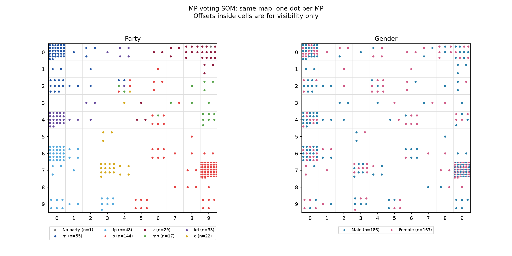
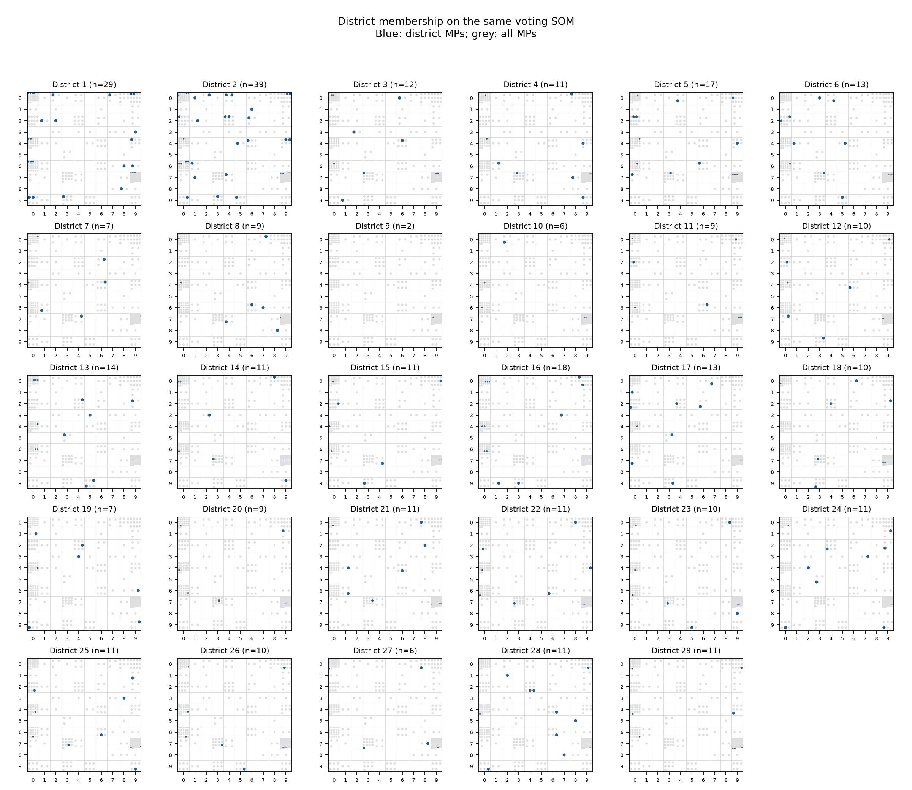
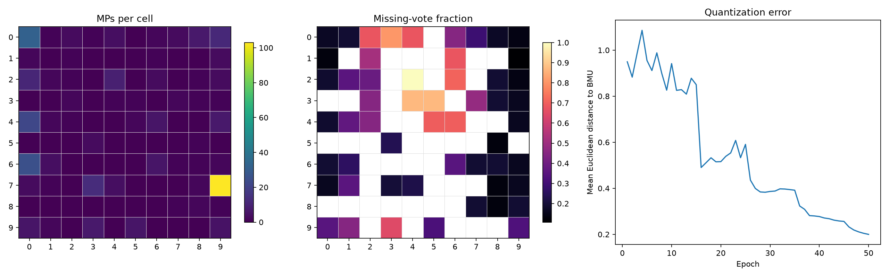

# Task 4.3 - Clustering MPs by voting behaviour

## Reproduce the experiment

From the repository root:

```sh
python -m pip install -r exp4/requirements.txt
python -m exp4.task4_3
python -m unittest exp4.test_task4_3 -v
```

The script also runs directly (`python exp4/task4_3.py`) and resolves the data
directory relative to the script, independently of the working directory.
Use `--seed`, `--epochs`, `--data-dir`, or `--output-dir` to change the defaults.
The committed results use seed 42 and 50 epochs, with NumPy 2.5.3 and
Matplotlib 3.11.2 on Python 3.14.

## Method

Each of the 349 MPs is represented by 31 votes, loaded in row-major order.
No = 0, yes = 1, and abstention/absence = 0.5, exactly as supplied. No labels
enter training. The names file is Latin-1; party and gender comment headers
are ignored when loading their numerical codes.

The SOM has 100 weight vectors arranged on a planar 10 x 10 grid. Initial
weights are uniform in [0, 1]. For every randomly shuffled epoch, the winning
node minimizes squared Euclidean distance in the 31-dimensional vote space.
Its weights and those of its square grid neighbourhood move toward the input:

`w <- w + learning_rate * (vote_vector - w)`

The grid neighbourhood uses Chebyshev distance (including diagonals) with a
radius rounded from 5 down to 0; edges do not wrap. The learning rate decreases
linearly from 0.2 to 0.02. All MPs are mapped again after training. Each plot
uses these same final assignments. Multiple MPs in a cell are packed into
distinct display positions; these offsets have no analytical meaning.

## Results and interpretation



**Party and the left-right structure.** In the seed-42 map, m, kd, fp and c
mainly occupy the left side; v, mp and s mainly occupy the right side. This is
consistent with a broad separation between the traditional political blocs.
The displayed horizontal direction is arbitrary: the SOM can rotate or reflect
between runs, and its axes are not numerical ideological scores.

There is structure within these blocs as well: m, kd and fp occupy distinct
regions along the left edge, while v, mp and s occupy different regions along
the right edge. Thus a single left-right ordering does not describe every
voting difference. Euclidean distances between party-average vote vectors
support several of these relationships independently of map orientation:
s-mp = 0.911, v-mp = 1.469, and s-v = 1.947, versus m-v = 3.747 and
m-s = 3.508. Within the other bloc, kd-c = 2.060 and fp-c = 2.140.
The sole no-party MP maps alongside v, but one MP cannot establish a general
pattern for unaffiliated politicians.

**A second dimension.** The map separates parties within each bloc and also
spreads some members of each party toward the interior. The missing-vote plot
below shows high abstention/absence fractions in several interior cells, so
attendance or abstention is a plausible contributor to this variation.
It would be unjustified to call the second axis a specific ideological
dimension without the subjects of the 31 votes or further analysis. SOM axes
can mix several factors; distances between faraway map cells are only a
qualitative representation of distances in vote space.

**Gender.** Male and female MPs are interspersed across the same party regions.
The pair-agreement statistic below is close to its shuffled baseline. This
experiment provides no evidence of extra gender clustering in these votes.
That does not establish that gender never affects voting, or test a causal
effect after controlling for party membership.



**District.** Most district panels span several party regions rather than
forming separate geographical clusters. District codes 1-29 are kept as codes
because the provided dataset has no district-name lookup. Co-located MPs share
a district less often than under the global shuffled baseline. This gives no
support for excess same-district clustering here; it is not a test for every
possible geographic effect, and party composition can confound this comparison.

## Quantitative checks

The final mean Euclidean distance from each MP to its winning weight vector
(quantization error) is **0.1998**. There are **54 occupied cells**; the largest
contains **103 MPs**. This concentration is compatible with many similar voting
records and is why displaying just one label per cell would be misleading.
The topographic error is **1/349 = 0.00287**: for one MP the two closest nodes
are not adjacent, using the same eight-neighbour definition as training.
These are descriptive training-data diagnostics, not held-out prediction scores.

For every unordered pair of MPs sharing a cell, compute whether their labels
match, and divide matching pairs by all within-cell pairs. Large cells therefore
contribute more to this statistic. Shuffle each label vector 500 times while
holding the learned map fixed; this retains the category frequencies.

| Attribute | Observed agreement | Shuffled mean | Shuffled 95% interval | Upper-tail permutation p |
|---|---:|---:|---:|---:|
| Party | 0.9928 | 0.2335 | 0.2026-0.2733 | 0.0020 |
| Gender | 0.4982 | 0.5009 | 0.4931-0.5157 | 0.6267 |
| District | 0.0330 | 0.0428 | 0.0366-0.0510 | 1.0000 |

The p value is `(1 + shuffled values >= observed) / 501`; it asks only about
excess agreement, not a two-sided departure. The intervals describe shuffled
values, not confidence intervals for the observed statistic. In particular,
the district result below the interval must not be described as identical to
random mixing. These are exploratory, unadjusted comparisons on a small
historical set of votes.

Four independent initializations give similar descriptive conclusions:

| Seed | Quantization error | Occupied cells | Party agreement | Gender agreement | District agreement |
|---|---:|---:|---:|---:|---:|
| 0 | 0.2195 | 48 | 0.9897 | 0.4968 | 0.0348 |
| 1 | 0.1960 | 46 | 0.9929 | 0.4982 | 0.0330 |
| 2 | 0.1833 | 48 | 0.9924 | 0.4975 | 0.0341 |
| 42 | 0.1998 | 54 | 0.9928 | 0.4982 | 0.0330 |



Across the dataset, **26.02%** of entries equal 0.5. They are numerical
midpoints for this assignment, not known neutral opinions. Similar absence
patterns can therefore make MPs appear similar. White cells in the missing-vote
panel have no assigned MPs. Learning is not monotonic while neighbourhoods are
large; the error falls as the radius shrinks and the map fine-tunes.

## Saved outputs and validation

`results/task4_3/` contains the three figures above, `metrics.json` (including
all pairwise party-mean distances in the order no party, m, fp, s, v, mp, kd, c),
`mp_assignments.csv` (all 349 names and zero-based row/column positions), and
`som.npz` (10 x 10 x 31 weights, flattened winning indices, and learning curve).

Six unit tests cover source-data alignment, Euclidean winner selection,
non-wrapping neighbourhoods, deterministic bounded learning, preservation of
all MPs in display positions, and a hand-calculated agreement example.
The full experiment was run successfully, the figures were visually checked,
and the additional seeds above were run using the same training settings.
